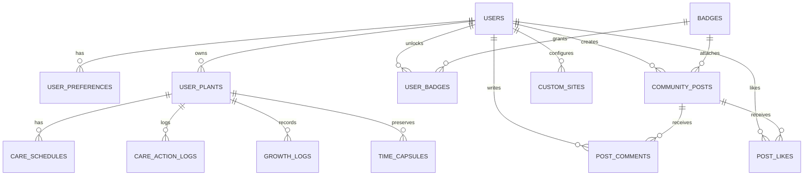

# TECHNICAL DOCUMENTATION: PLENTY (Houseplant Care Companion & Gamified Tracking)

---

## 1. Executive Technical Overview

- **Application Name**: PLENTY
- **Tagline**: *"Turn plant care into a more enjoyable habit."*
- **Platforms**: Flutter (Android & iOS)
- **Architecture**: **Feature-First Clean Architecture** with strict layer boundaries:
  - `domain/`: Pure Dart business entities, value objects, and repository contracts (Zero Flutter UI / 3rd-party dependencies).
  - `data/`: Data models/DTOs, SQLite local datasources, HTTP remote datasources, and repository implementations.
  - `presentation/`: Lightweight `ChangeNotifier` / `ValueNotifier` controllers, reactive screens, and atomic widgets.
  - `core/`: Shared infrastructure, database helpers, manual DI locator, route constants, design tokens, and utilities.
- **Dependency Injection**: **Manual Static Lazy Injector** (`Injector.xxx` with `??=` lazy getters) — Zero external service locator libraries, zero reflection, 100% sound null-safe, fully testable via constructor parameter fallback.
- **Data Strategy (Cache-First)**: Local SQLite database acts as the single source of truth for the UI. External botanical REST APIs (Perenual) are queried strictly on cache miss with a 400ms Debouncer to conserve daily API quotas.
- **Reactive State Management**: Vanilla Flutter primitives (`ChangeNotifier`, `ValueNotifier`, `ListenableBuilder`, `ValueListenableBuilder`) eliminating heavyweight 3rd-party frameworks.
- **Operational Pipelines**: Exhaustive Result pattern (`Result<T>` sealed class with `Success<T>` and `Error<T>`) for type-safe error propagation without unhandled exceptions.

```
+-------------------------------------------------------------------------------+
|                                  PLENTY UI                                    |
|         (ListenableBuilder / ValueListenableBuilder / Micro-Widgets)           |
+---------------------------------------+---------------------------------------+
                                        | (Observes Controller State)
+---------------------------------------v---------------------------------------+
|                         PRESENTATION CONTROLLERS                              |
|   HomeController | DailyCareController | ChooseSpeciesController | AuthCtrl   |
+---------------------------------------+---------------------------------------+
                                        | (Dispatches Domain Operations)
+---------------------------------------v---------------------------------------+
|                           DOMAIN LAYER (Pure Dart)                            |
|        Entities & Models: Plant, CareSchedule, GrowthLog, BadgeItem           |
|        Repository Contracts: IPlantRepository, IDailyCareRepository, etc.     |
+---------------------------------------+---------------------------------------+
                                        | (Implemented by Data Layer)
+---------------------------------------v---------------------------------------+
|                            DATA ACCESS LAYER                                  |
|   PlantRepositoryImpl | DailyCareRepositoryImpl | CommunityRepositoryImpl     |
+-------------------+-----------------------------------+-----------------------+
                    | (Cache Check / Local Store)       | (Cache Miss / 400ms Debounce)
+-------------------v-------------------+   +-----------v-----------------------+
|          LOCAL SQLITE ENGINE          |   |       PERENUAL BOTANICAL API      |
|  users, user_plants, care_schedules,  |   |    species-list, species/details  |
|  growth_logs, badges, community_posts |   |                                   |
+---------------------------------------+   +-----------------------------------+
```

---

## 2. Tech Stack & Dependencies Audit

Configured in `pubspec.yaml` with zero deprecated or redundant packages:

```yaml
environment:
  sdk: ^3.12.2 # Sound Null-Safety, Records, Pattern Matching & Sealed Classes
```

### 2.1 Core Dependencies

| Package | Version | Purpose & Architecture Scope |
| :--- | :--- | :--- |
| **`sqflite`** | `^2.4.2` | Primary local relational persistence engine managing SQLite database (`plenty.db`), ACID transactions, foreign keys (`PRAGMA foreign_keys = ON;`), and batch operations. |
| **`path`** | `^1.9.1` | Cross-platform filesystem path utility for database initialization and local media resolution. |
| **`shared_preferences`** | `^2.5.5` | Key-value store for session tokens, active login flags, and onboarding preferences via `PreferenceHandler`. |
| **`http`** | `^1.3.0` | HTTP client wrapped inside `ApiClient` for botanical REST endpoints with timeout and failure mapping. |
| **`flutter_dotenv`** | `^6.0.1` | Environment variable loader parsing API keys and base URLs securely from `.env`. |
| **`image_picker`** | `^1.1.2` | Camera and gallery picker utility abstracted via `ImagePickerHelper`. |
| **`fl_chart`** | `^1.2.0` | Vector charting engine rendering historical plant growth height curves. |
| **`lottie`** | `^3.5.1` | Vector animation renderer for gamified badge unlocking and celebration modals. |
| **`google_fonts`** | `^8.2.1` | Typography loader serving Plus Jakarta Sans design system fonts. |
| **`bcrypt`** | `^1.2.0` | Secure password hashing for local user authentication. |
| **`crypto`** | `^3.0.7` | Cryptographic hashing utility for checksums and unique entity key derivation. |
| **`cupertino_icons`** | `^1.0.8` | Standard iOS-style iconography complementing Material icons. |
| **`sqlite_viewer2`** | `^2.0.0` | Developer diagnostics utility for in-app SQLite database inspection in debug mode. |

### 2.2 Dev & Testing Dependencies

- **`flutter_test`**: Flutter testing framework for unit and widget testing.
- **`flutter_lints` (`^6.0.0`)**: Official Dart linter rules enforcing code cleanliness and safety.
- **`sqflite_common_ffi` (`^2.4.2+1`)**: FFI SQLite driver enabling headless local database unit & integration tests.
- **`mocktail` (`^1.0.4`)**: Type-safe Dart mocking library without code generation.
- **`flutter_launcher_icons` (`^0.14.4`)**: Automated build-time launcher icon generator.

---

## 3. Manual Dependency Injection Architecture (`Injector`)

Dependency injection is handled via a **pure static class** located at `lib/core/di/injector.dart`. It employs private lazy singletons (`??=`) to resolve the entire dependency graph on-demand without any external library runtime overhead or startup delay.

```dart
/// Central manual dependency injector using lazy initialization.
class Injector {
  Injector._();

  // Core & Database
  static DatabaseHelper? _databaseHelper;
  static DatabaseHelper get databaseHelper =>
      _databaseHelper ??= DatabaseHelper.instance;

  // Datasources
  static PlantRemoteDataSource? _plantRemoteDataSource;
  static PlantRemoteDataSource get plantRemoteDataSource =>
      _plantRemoteDataSource ??= PlantRemoteDataSourceImpl();

  static AuthLocalDataSource? _authLocalDataSource;
  static AuthLocalDataSource get authLocalDataSource =>
      _authLocalDataSource ??= AuthLocalDataSourceImpl(databaseHelper);

  // Repositories
  static IAuthRepository? _authRepository;
  static IAuthRepository get authRepository =>
      _authRepository ??= AuthRepositoryImpl(authLocalDataSource);

  static IBadgeRepository? _badgeRepository;
  static IBadgeRepository get badgeRepository =>
      _badgeRepository ??= BadgeRepositoryImpl(dbHelper: databaseHelper);

  static IUserRepository? _userRepository;
  static IUserRepository get userRepository =>
      _userRepository ??= UserRepositoryImpl(dbHelper: databaseHelper);

  static ISiteRepository? _siteRepository;
  static ISiteRepository get siteRepository =>
      _siteRepository ??= SiteRepositoryImpl(dbHelper: databaseHelper);

  static IPlantRepository? _plantRepository;
  static IPlantRepository get plantRepository =>
      _plantRepository ??= PlantRepositoryImpl(
        dbHelper: databaseHelper,
        remoteDataSource: plantRemoteDataSource,
      );

  static IStreakRepository? _streakRepository;
  static IStreakRepository get streakRepository =>
      _streakRepository ??= StreakRepositoryImpl(
        dbHelper: databaseHelper,
        badgeRepo: badgeRepository,
      );

  static IDailyCareRepository? _dailyCareRepository;
  static IDailyCareRepository get dailyCareRepository =>
      _dailyCareRepository ??= DailyCareRepositoryImpl(
        dbHelper: databaseHelper,
        plantRepo: plantRepository,
        streakRepo: streakRepository,
      );

  static ICommunityRepository? _communityRepository;
  static ICommunityRepository get communityRepository =>
      _communityRepository ??= CommunityRepositoryImpl(dbHelper: databaseHelper);

  static IGrowthRepository? _growthRepository;
  static IGrowthRepository get growthRepository =>
      _growthRepository ??= GrowthRepositoryImpl(dbHelper: databaseHelper);
}
```

### Dependency Resolution Rules & Benefits
1. **Zero Initialization in `main.dart`**: Eliminates mandatory asynchronous bootstrapping in `main()`.
2. **Deterministic Topological Order**: Getters cascade automatically (e.g. `dailyCareRepository` triggers `plantRepository`, `streakRepository`, and `databaseHelper`).
3. **100% Mockable in Unit/Widget Tests**: Controllers maintain constructor dependency injection with fallback to `Injector.xxx`.

---

## 4. Directory & Layer Organization

```
lib/
├── core/                                   # Central shared infrastructure
│   ├── constants/                          # Global constants, colors, typography, XP config
│   │   ├── api_constants.dart              # Perenual endpoints & timeout configurations
│   │   ├── app_colors.dart                 # Hex color tokens (Primary, Canvas, Accents)
│   │   ├── app_images.dart                 # Asset image paths
│   │   ├── task_types.dart                 # TaskType enum (siram, bersih_bersih, monitor_tinggi)
│   │   └── xp_config.dart                  # Gamification XP metrics & level formulas
│   ├── database/                           # SQLite database singleton & migrations
│   │   └── database_helper.dart            # Schema DDL, table definitions, seeds
│   ├── di/                                 # Dependency Injection
│   │   └── injector.dart                   # Static Injector class
│   ├── domain/models/                      # Shared domain models (BadgeItem, GrowthLogModel)
│   ├── error/                              # Typed error & failure models
│   │   ├── failure.dart                    # Failure hierarchy (DatabaseFailure, ServerFailure, etc.)
│   │   └── result.dart                     # Sealed Result<T> pattern (Success<T>, Error<T>)
│   ├── network/                            # Network adapter
│   │   └── api_client.dart                 # HTTP client with error & quota handling
│   ├── router/                             # Route constants
│   │   └── app_routes.dart                 # Centralized route names
│   ├── storage/                            # Key-value storage
│   │   └── preference_handler.dart         # SharedPreferences session wrapper
│   ├── theme/                              # Design system styling
│   │   ├── app_theme.dart                  # Material ThemeData definitions
│   │   └── app_typography.dart             # Plus Jakarta Sans typography tokens
│   ├── utils/                              # Standalone utility helpers
│   │   ├── botanical_translator.dart       # Botanical terms EN -> ID dictionary
│   │   ├── botanical_unit_converter.dart   # Imperial to Metric conversion helper
│   │   ├── debouncer.dart                  # Input rate-limiting timer (400ms)
│   │   ├── image_picker_helper.dart        # Camera & gallery bottom sheet modal
│   │   └── extensions/                     # Navigation & UI extensions
│   └── widgets/                            # Generic, reusable UI widgets
│       ├── custom_button.dart
│       └── custom_text_field.dart
│
└── features/                               # Modular Feature Domains
    ├── auth/                               # User authentication & session management
    │   ├── data/                           # AuthLocalDataSource, AuthRepositoryImpl
    │   ├── domain/                         # UserModel, AuthRepository contract
    │   └── presentation/                   # AuthController, LoginScreen, RegisterScreen
    ├── onboarding/                         # User preference survey & guided setup
    │   ├── domain/                         # UserPreferences model
    │   └── presentation/                   # OnboardingController, WelcomeScreen, Step Widgets
    ├── plant_catalog/                      # Botanical catalog search & plant adoption wizard
    │   ├── data/                           # PlantRemoteDataSource, Catalog mapping
    │   ├── domain/                         # Species & Catalog entities
    │   └── presentation/                   # ChooseSpeciesController, AddPlantFlowController, AddPlantScreen
    ├── garden/                             # Virtual garden dashboard, plant detail, growth & streak
    │   ├── data/                           # PlantRepositoryImpl, StreakRepositoryImpl, GrowthRepo, SiteRepo
    │   ├── domain/                         # Plant, Streak, Site, TimeCapsule entities & repos
    │   └── presentation/                   # HomeController, PlantDetailsScreen, Populated/Empty views
    ├── daily_care/                         # Daily care routine, checklist & care history
    │   ├── data/                           # DailyCareRepositoryImpl
    │   ├── domain/                         # CareTaskModel, CareScheduleModel, CareActionLogModel
    │   └── presentation/                   # DailyCareController, DailyCareScreen, CareHistoryScreen
    ├── profile/                            # User profile, master badges & achievements
    │   ├── data/                           # BadgeRepositoryImpl, UserRepositoryImpl
    │   ├── domain/                         # BadgeRepository, UserRepository contracts
    │   └── presentation/                   # ProfileTab, ProfileEditScreen, AllBadgesScreen, BadgeDetailScreen
    └── community/                          # Community social feed, discussions & badge sharing
        ├── data/                           # CommunityRepositoryImpl
        ├── domain/                         # CommunityPost, PostCommentModel, Repository contract
        └── presentation/                   # CommunityController, CommunityScreen, CreatePostScreen
```

---

## 5. Database Schema & Relational Integrity

Managed by `DatabaseHelper` (`plenty.db`, Version 1) with `PRAGMA foreign_keys = ON;` and cascade deletions.



### Table Specifications

#### 1. `users`
| Column | Type | Constraints | Description |
| :--- | :--- | :--- | :--- |
| `id` | `INTEGER` | `PRIMARY KEY AUTOINCREMENT` | Unique user ID. Default seeded ID is `1`. |
| `email` | `TEXT` | `UNIQUE NOT NULL` | User email address. |
| `username` | `TEXT` | `UNIQUE` | Unique user handle. |
| `password` | `TEXT` | `NOT NULL DEFAULT ''` | Bcrypt hashed password. |
| `display_name` | `TEXT` | `NOT NULL` | Display name. |
| `bio` | `TEXT` | `NULL` | User profile bio. |
| `avatar_url` | `TEXT` | `NULL` | Profile picture path. |
| `streak_count` | `INTEGER` | `NOT NULL DEFAULT 0` | Active consecutive days streak. |
| `longest_streak` | `INTEGER` | `NOT NULL DEFAULT 0` | All-time highest streak record. |
| `total_xp` | `INTEGER` | `NOT NULL DEFAULT 0` | Total accumulated XP. |
| `level` | `INTEGER` | `NOT NULL DEFAULT 1` | Global user level (`levelForXp(totalXp)`). |
| `unlocked_badges_count` | `INTEGER` | `NOT NULL DEFAULT 0` | Total unlocked badges tally. |
| `last_streak_date` | `TEXT` | `NULL` | Date (`YYYY-MM-DD`) of latest streak evaluation. |
| `created_at` | `TEXT` | `NOT NULL` | ISO8601 creation timestamp. |

#### 2. `user_preferences`
| Column | Type | Constraints | Description |
| :--- | :--- | :--- | :--- |
| `id` | `TEXT` | `PRIMARY KEY` | Preference entity ID. |
| `user_id` | `INTEGER` | `NOT NULL, FK -> users(id) ON DELETE CASCADE` | Associated user ID. |
| `experience_level` | `TEXT` | `NOT NULL` | `'beginner'`, `'intermediate'`, or `'advanced'`. |
| `daily_time_minutes` | `REAL` | `DEFAULT 15.0` | Available daily care time in minutes. |
| `has_pets` | `INTEGER` | `DEFAULT 0` | Pet safety flag (`1` = true, `0` = false). |
| `has_kids` | `INTEGER` | `DEFAULT 0` | Child safety flag (`1` = true, `0` = false). |
| `available_time` | `TEXT` | `NULL` | Time slot label. |
| `safety_restriction` | `TEXT` | `NULL` | Safety category restriction. |
| `has_completed_onboarding` | `INTEGER` | `NOT NULL DEFAULT 0` | Onboarding completion flag. |

#### 3. `user_plants`
| Column | Type | Constraints | Description |
| :--- | :--- | :--- | :--- |
| `id` | `TEXT` | `PRIMARY KEY` | Plant instance ID (`plant_<timestamp>`). |
| `user_id` | `TEXT` | `NOT NULL` | Owner user ID string. |
| `species_id` | `INTEGER` | `NULL` | Perenual species ID. |
| `catalog_id` | `TEXT` | `NULL` | Catalog reference key. |
| `species_name` | `TEXT` | `NOT NULL DEFAULT ''` | Common species name. |
| `scientific_name` | `TEXT` | `NULL` | Latin botanical name. |
| `nickname` | `TEXT` | `NOT NULL DEFAULT 'Tanaman Hias'` | Custom plant nickname. |
| `room_name` | `TEXT` | `NOT NULL DEFAULT 'Ruang Tamu'` | Assigned room name. |
| `placement_type` | `TEXT` | `NOT NULL DEFAULT 'Indoor'` | Placement type. |
| `window_distance` | `TEXT` | `NULL` | Distance from window. |
| `pot_size` | `TEXT` | `NULL` | Pot diameter / drainage info. |
| `initial_height` | `REAL` | `NOT NULL DEFAULT 30.0` | Initial measured height in cm. |
| `current_height` | `REAL` | `NOT NULL DEFAULT 30.0` | Latest recorded height in cm. |
| `image_path` | `TEXT` | `NULL` | Local photo path or remote URL. |
| `watering_interval_days` | `INTEGER` | `NOT NULL DEFAULT 7` | Watering frequency in days. |
| `sunlight_preference` | `TEXT` | `NULL` | Sunlight requirement label. |
| `is_pet_friendly` | `INTEGER` | `DEFAULT 0` | Pet safe flag (`1` = safe). |
| `adopted_at` | `TEXT` | `NOT NULL DEFAULT ''` | Adoption date string. |
| `is_indoor` | `INTEGER` | `NOT NULL DEFAULT 1` | Indoor placement flag. |
| `sunlight_condition` | `TEXT` | `NULL` | Lighting condition. |
| `site` | `TEXT` | `NULL` | Location name. |
| `growth_stage` | `TEXT` | `NOT NULL DEFAULT 'mature'` | Stage (`'seed'`, `'sprout'`, `'mature'`). |
| `level` | `INTEGER` | `NOT NULL DEFAULT 1` | Plant gamified level. |
| `xp` | `INTEGER` | `NOT NULL DEFAULT 0` | Plant accumulated XP. |
| `health_status` | `TEXT` | `NOT NULL DEFAULT 'healthy'` | Health status (`'healthy'`, `'needs_care'`). |
| `cover_photo_path` | `TEXT` | `NULL` | Cover photo path. |
| `default_watering_interval` | `INTEGER` | `NOT NULL DEFAULT 7` | Default watering cadence. |
| `care_level` | `TEXT` | `NULL` | Care difficulty. |
| `toxicity` | `TEXT` | `NULL` | Toxicity detail. |
| `description` | `TEXT` | `NULL` | Botanical overview description. |
| `growth_rate` | `TEXT` | `NULL` | Growth speed (`Cepat`, `Sedang`, `Lambat`). |
| `growth_cycle` | `TEXT` | `NULL` | Life cycle (`Perenial`, `Semusim`). |
| `pruning_season` | `TEXT` | `NULL` | Pruning guideline. |
| `flower_status` | `TEXT` | `NULL` | Blooming details. |
| `is_archived` | `INTEGER` | `NOT NULL DEFAULT 0` | Archive flag (`1` = archived). |

#### 4. `care_schedules`
| Column | Type | Constraints | Description |
| :--- | :--- | :--- | :--- |
| `id` | `TEXT` | `PRIMARY KEY` | Schedule ID (`sched_<plantId>_<taskType>`). |
| `user_plant_id` | `TEXT` | `NOT NULL, FK -> user_plants(id) ON DELETE CASCADE` | Associated plant ID. |
| `task_type` | `TEXT` | `NOT NULL` | Task ID (`'siram'`, `'bersih_bersih'`, `'monitor_tinggi'`). |
| `interval_days` | `INTEGER` | `NOT NULL` | Schedule interval in days. |
| `last_performed_at` | `TEXT` | `NULL` | Last completion timestamp. |
| `next_due_date` | `TEXT` | `NOT NULL` | ISO8601 target due date. |
| `is_active` | `INTEGER` | `NOT NULL DEFAULT 1` | Active routine toggle flag. |

#### 5. `care_action_logs`
| Column | Type | Constraints | Description |
| :--- | :--- | :--- | :--- |
| `id` | `TEXT` | `PRIMARY KEY` | Action log ID. |
| `user_plant_id` | `TEXT` | `NOT NULL, FK -> user_plants(id) ON DELETE CASCADE` | Target plant ID. |
| `task_type` | `TEXT` | `NOT NULL` | Task completed. |
| `action_type` | `TEXT` | `NULL` | Action category. |
| `performed_at` | `TEXT` | `NULL` | Performed timestamp. |
| `completed_at` | `TEXT` | `NOT NULL` | Completion timestamp. |
| `log_date` | `TEXT` | `NULL` | Date string (`YYYY-MM-DD`). |
| `xp_awarded` | `INTEGER` | `DEFAULT 0` | XP granted (+10 or +15). |
| `notes` | `TEXT` | `NULL` | User notes. |

#### 6. `growth_logs`
| Column | Type | Constraints | Description |
| :--- | :--- | :--- | :--- |
| `id` | `TEXT` | `PRIMARY KEY` | Growth log ID. |
| `user_plant_id` | `TEXT` | `NOT NULL, FK -> user_plants(id) ON DELETE CASCADE` | Target plant ID. |
| `logged_at` | `TEXT` | `NOT NULL` | Timestamp recorded. |
| `height_cm` | `REAL` | `NOT NULL` | Measured height in cm. |
| `leaf_count` | `INTEGER` | `NULL` | Total leaf count. |
| `photo_path` | `TEXT` | `NULL` | Photo snapshot path. |
| `source` | `TEXT` | `NOT NULL DEFAULT 'manual'` | Source (`'initial'`, `'daily_task'`, `'manual'`). |
| `note` | `TEXT` | `NULL` | Growth observation notes. |

#### 7. `time_capsules`
| Column | Type | Constraints | Description |
| :--- | :--- | :--- | :--- |
| `id` | `TEXT` | `PRIMARY KEY` | Capsule ID. |
| `user_plant_id` | `TEXT` | `NOT NULL, FK -> user_plants(id) ON DELETE CASCADE` | Associated plant ID. |
| `photo_path` | `TEXT` | `NULL` | Plant photo at adoption. |
| `note` | `TEXT` | `NULL` | Time capsule message. |
| `created_at` | `TEXT` | `NOT NULL` | Creation timestamp. |
| `unlock_at` | `TEXT` | `NOT NULL` | Target unlock timestamp. |
| `is_unlocked` | `INTEGER` | `NOT NULL DEFAULT 0` | Unlock status (`1` = unlocked). |

#### 8. `badges` (Master Badges Definition)
| Column | Type | Constraints | Description |
| :--- | :--- | :--- | :--- |
| `id` | `TEXT` | `PRIMARY KEY` | Master badge ID (`first_plant`, `water_streak`, etc.). |
| `title` | `TEXT` | `NOT NULL` | Badge name. |
| `description` | `TEXT` | `NOT NULL` | Achievement criteria narrative. |
| `icon_name` | `TEXT` | `NOT NULL` | Vector icon identifier (`sprout`, `droplets`, etc.). |
| `tier_name` | `TEXT` | `NOT NULL DEFAULT 'Normal'` | Badge tier. |
| `level` | `INTEGER` | `NOT NULL DEFAULT 1` | Badge tier level. |
| `target_total` | `INTEGER` | `NOT NULL DEFAULT 1` | Target progress milestone required. |
| `bg_color_hex` | `TEXT` | `NOT NULL DEFAULT '#EBF7F1'` | Background card hex color. |
| `accent_color_hex` | `TEXT` | `NOT NULL DEFAULT '#2D6A4F'` | Accent illumination hex color. |

#### 9. `user_badges` (User Unlocked Junction)
| Column | Type | Constraints | Description |
| :--- | :--- | :--- | :--- |
| `id` | `TEXT` | `PRIMARY KEY` | Junction ID (`ub_<user>_<badge>`). |
| `user_id` | `INTEGER` | `NOT NULL, FK -> users(id) ON DELETE CASCADE` | Associated user ID. |
| `badge_id` | `TEXT` | `NOT NULL, FK -> badges(id) ON DELETE CASCADE` | Associated badge ID. |
| `is_unlocked` | `INTEGER` | `NOT NULL DEFAULT 0` | Unlocked flag (`1` = unlocked). |
| `current_progress` | `INTEGER` | `NOT NULL DEFAULT 0` | Current numerical progress towards `target_total`. |
| `unlocked_at` | `TEXT` | `NULL` | Unlocked timestamp string. |

#### 10. `community_posts`
| Column | Type | Constraints | Description |
| :--- | :--- | :--- | :--- |
| `id` | `TEXT` | `PRIMARY KEY` | Post ID. |
| `user_id` | `INTEGER` | `NOT NULL, FK -> users(id) ON DELETE CASCADE` | Author user ID. |
| `category` | `TEXT` | `NOT NULL` | Category (`'pertanyaan'`, `'tips'`, `'pencapaian'`). |
| `caption` | `TEXT` | `NULL` | Post text content. |
| `image_url` | `TEXT` | `NULL` | Attached image URL/path. |
| `badge_id` | `TEXT` | `NULL, FK -> badges(id) ON DELETE SET NULL` | Linked badge reference for achievement posts. |
| `kudos_count` | `INTEGER` | `DEFAULT 0` | Total like count. |
| `is_liked` | `INTEGER` | `DEFAULT 0` | Like status for current user session. |
| `comment_count` | `INTEGER` | `DEFAULT 0` | Total comments count. |
| `created_at` | `TEXT` | `NOT NULL` | Post creation timestamp. |

#### 11. `post_comments`
| Column | Type | Constraints | Description |
| :--- | :--- | :--- | :--- |
| `id` | `TEXT` | `PRIMARY KEY` | Comment ID. |
| `post_id` | `TEXT` | `NOT NULL, FK -> community_posts(id) ON DELETE CASCADE` | Target post ID. |
| `user_id` | `INTEGER` | `NOT NULL, FK -> users(id) ON DELETE CASCADE` | Author user ID. |
| `content` | `TEXT` | `NOT NULL` | Comment body text. |
| `created_at` | `TEXT` | `NOT NULL` | Comment creation timestamp. |

#### 12. `post_likes`
| Column | Type | Constraints | Description |
| :--- | :--- | :--- | :--- |
| `post_id` | `TEXT` | `NOT NULL, FK -> community_posts(id) ON DELETE CASCADE` | Target post ID. |
| `user_id` | `INTEGER` | `NOT NULL, FK -> users(id) ON DELETE CASCADE` | Liker user ID. |
| `created_at` | `TEXT` | `NOT NULL` | Liked timestamp. |
| *Composite PK* | - | `PRIMARY KEY (post_id, user_id)` | Enforces unique like per user per post. |

#### 13. `custom_sites`
| Column | Type | Constraints | Description |
| :--- | :--- | :--- | :--- |
| `id` | `TEXT` | `PRIMARY KEY` | Custom room ID (`site_<timestamp>`). |
| `user_id` | `INTEGER` | `NOT NULL DEFAULT 1, FK -> users(id) ON DELETE CASCADE` | Owner user ID. |
| `name` | `TEXT` | `NOT NULL` | Room name (e.g. "Balkon Atas"). |
| `icon_code` | `INTEGER` | `NOT NULL` | Flutter `IconData.codePoint`. |
| `is_indoor` | `INTEGER` | `NOT NULL DEFAULT 1` | Environment flag (`1` = indoor). |
| `created_at` | `TEXT` | `NOT NULL` | Creation timestamp. |

---

## 6. Gamification System & Badge Rules

### 6.1 Experience Points (XP) & Level Progression (`XpConfig`)

Configured centrally in `lib/core/constants/xp_config.dart`:

| Task Type | Task Name | Reward XP | Rationale |
|---|---|---|---|
| `siram` | Siram Tanaman | **+10 XP** | Regular routine maintaining soil moisture |
| `bersih_bersih` | Bersihkan Tanaman | **+10 XP** | Foliage dust cleaning and maintenance |
| `monitor_tinggi` | Log Harian & Ukur Tinggi | **+15 XP** | Higher reward requiring measurement & photo log |

- **Threshold per Level**: `100 XP`
- **Level Formula**: $\text{Level} = \left\lfloor \frac{\text{Total XP}}{100} \right\rfloor + 1$
- **XP towards Next Level**: $\text{Progress XP} = \text{Total XP} \pmod{100}$

### 6.2 Master Badges Matrix

```mermaid
gantt
    title Master Badges & Milestone Progress
    dateFormat  X
    axisFormat %d

    section Adopsi Pertama (1 Tanaman)
    first_plant :active, 0, 1

    section Penyiram Setia (7 Hari Streak)
    water_streak : 0, 7

    section Kapsul Waktu (1 Kapsul)
    time_capsule : 0, 1

    section Kolektor Rimbun (5 Tanaman)
    plant_collector : 0, 5

    section Dokter Tanaman (10 Log Kesehatan)
    doctor_green : 0, 10

    section Pencari Cahaya (1 Penempatan Ideal)
    sun_master : 0, 1
```



| Badge ID | Badge Title | Target | Description | Accent Color |
|---|---|---|---|---|
| `first_plant` | **Adopsi Pertama** | 1 | Mengadopsi tanaman pertama untuk memulai perjalanan berkebunmu. | `#2D6A4F` |
| `water_streak` | **Penyiram Setia** | 7 | Menyiram tanaman tepat waktu selama 7 hari berturut-turut. | `#956400` |
| `time_capsule` | **Kapsul Waktu** | 1 | Membuat pesan kapsul waktu pertama saat menanam. | `#1F6C9F` |
| `plant_collector` | **Kolektor Rimbun** | 5 | Memiliki minimal 5 tanaman aktif di kebun virtualmu. | `#2D6A4F` |
| `doctor_green` | **Dokter Tanaman** | 10 | Mencatat jurnal kondisi kesehatan tanaman sebanyak 10 kali. | `#5B4B8A` |
| `sun_master` | **Pencari Cahaya** | 1 | Menempatkan tanaman di lokasi dengan intensitas cahaya ideal. | `#956400` |

---

## 7. Error Handling & Safety Standards

### 7.1 Sealed `Result<T>` Pattern

Located at `lib/core/error/result.dart`:

```dart
sealed class Result<T> {
  const Result();

  bool get isSuccess => this is Success<T>;
  bool get isError => this is Error<T>;

  T? get dataOrNull => switch (this) {
        Success(:final data) => data,
        Error() => null,
      };

  Failure? get failureOrNull => switch (this) {
        Success() => null,
        Error(:final failure) => failure,
      };

  R when<R>({
    required R Function(T data) success,
    required R Function(Failure failure) error,
  }) {
    return switch (this) {
      Success(:final data) => success(data),
      Error(:final failure) => error(failure),
    };
  }
}

final class Success<T> extends Result<T> {
  final T data;
  const Success(this.data);
}

final class Error<T> extends Result<T> {
  final Failure failure;
  const Error(this.failure);
}
```

### 7.2 Failure Hierarchy (`lib/core/error/failure.dart`)

- **`DatabaseFailure`**: SQLite constraint violations, disk I/O, or transaction rollback.
- **`AuthFailure`**: Invalid email/password combination or unauthorized session.
- **`NotFoundFailure`**: Target entity absent from local database.
- **`ValidationFailure`**: Incomplete required fields or out-of-bound inputs.
- **`ServerFailure`**: HTTP non-200 status codes (e.g. 500, 429).
- **`NetworkFailure`**: Device offline or connection timeouts.
- **`CacheFailure`**: Local JSON cache parsing errors.

---

## 8. Verification & Quality Assurance

- **Static Analysis**: `flutter analyze` runs clean with zero warnings under `flutter_lints ^6.0.0`.
- **Null Safety**: 100% sound null safety, zero unchecked force-unwrap operators (`!`).
- **Whitespace Integrity**: Strictly standard UTF-8 whitespace (zero `\u00A0` non-breaking spaces).
- **Test Suite**: Automated unit and widget tests executed with headless SQLite via `sqflite_common_ffi` and mocktail.
